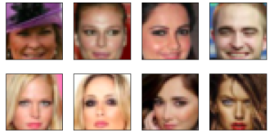
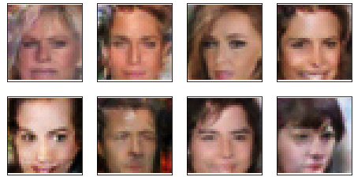

# Face Generation using Deep Convolutional GANs

## Overview

In this project, I applied Deep Convolutional GANs (DCGAN) to generate new human face images. [CelebA dataset](http://mmlab.ie.cuhk.edu.hk/projects/CelebA.html) was used as our training input, and below shows some example pictures in CelebA and our training results.

